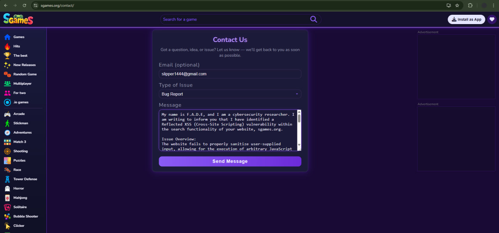

# Reflected XSS Vulnerability in Search Functionality
## Overview
During a security assessment of the sgames.org portal, I discovered a Reflected Cross-Site Scripting (XSS) vulnerability. This flaw allows an attacker to execute arbitrary JavaScript in the victim's browser context via a crafted URL.

## Technical Analysis
* **Vulnerability Type:** Reflected XSS
* **Affected Parameter:** q (search query)
* **Payload:** ``
* **Vector:** The application reflects the user input from the search bar directly into the HTML Document Object Model (DOM) without proper sanitization.

* ## Proof of Concept
1. Navigate to the target URL with the payload attached:
https://sgames.org/searchgames/?q=%3Cimg+src%3D%22abc%22+onerror%3Dalert%28%22abc%22%29%3B%3E
2. Observe the JavaScript execution.

3. ### Video Evidence
  4.[Link to the PoC Video](poc-xss-video.mp4)

5. ### Screenshot Evidence of report to developers
6. 

## Timeline
* **April 2, 2026:** Vulnerability discovered during hardware testing.
* **April 2, 2026:** Technical analysis and PoC video recorded.
* **April 2, 2026:** Responsible disclosure sent to the sgames.org support team via the contact form.
